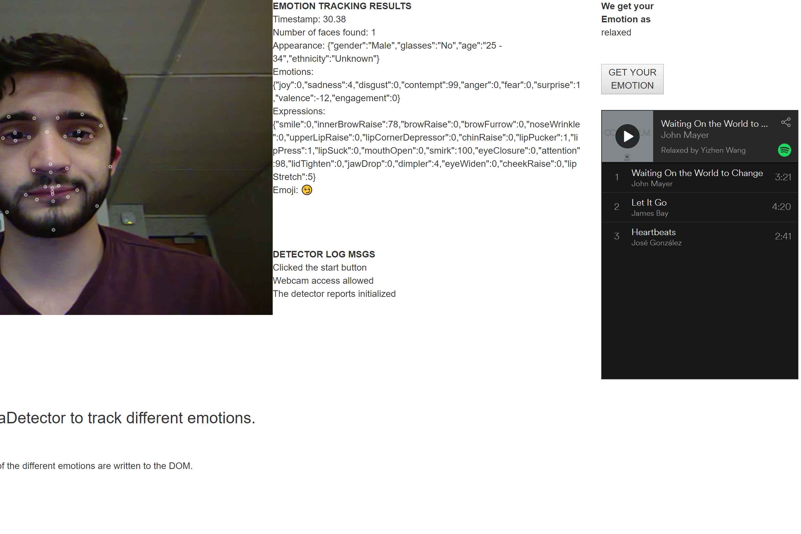

# Robert Scalfani
## Design Portfolio
I'm Robi and I'm a student of computer science at WPI. This term has been a particularly UI-focused term for me, not only because I'm taking HCI (Duh!) but also because I was the head of UI for my Software Engineering Team's project that ended up winning best overall aplication in the class.  
It has been fascinating watching people interact with the UI's that I've created, seeing what worked and being surprised by what didn't. It became abundantly clear to me this term that when designing something it's easy for it to make sense to you, but not anyone else.  
I've learned a ton about HCI from both this class as well as Software Engineering, and I've been applying what I learned from both to the other.

[Click here to view my Reflection on the term as a whole and see my Design Manifesto.](page2.md)

|  <a href="https://medium.com/@mariana0pachon/al-the-bot-support-for-current-prison-inmates-4c8ddbcd066"> Design for Tension  |  <a href="https://medium.com/design-for-understanding/design-for-understanding-clear-communication-versus-persuasion-e634f93a998e"> Design for Understanding
:----------------------------:|:----------------------------:
  <a href="https://medium.com/@robis345/design-for-wellbeing-group-13-d9217bad94be"> Design for Wellbeing   |  <a href="https://medium.com/@vandana1anand/35590de784dd"> Design for Another World  |
    
  
Check out my [Design Manifesto](index.md).
