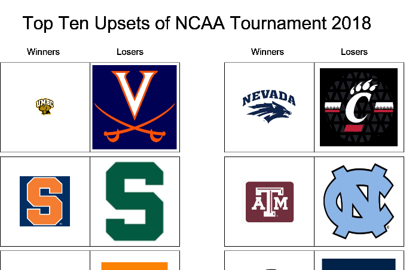

## Welcome to GitHub Pages

You can use the [editor on GitHub](https://github.com/RobertScalfani/HCIDesignPortfolio/edit/master/index.md) to maintain and preview the content for your website in Markdown files.
For more details see [GitHub Flavored Markdown](https://guides.github.com/features/mastering-markdown/).

### robert scalfani
## design portfolio
I'm Robi and I'm a student of computer science at WPI. This term has been a particularly UI-focused term for me, not only because I'm taking HCI (Duh!) but also because I was the head of UI for my Software Engineering Team's project that ended up winning best overall aplication in the class.\n
It has been fascinating watching people interact with the UI's that I've created, seeing what worked and being surprised by what didn't. It became abundantly clear to me this term that when designing something it's easy for it to make sense to you, but not anyone else.
I've learned a ton about HCI from both this class as well as Software Engineering, and I've been applying what I learned from both to the other.

  |  
:-------------------------:|:-------------------------:
  |  
