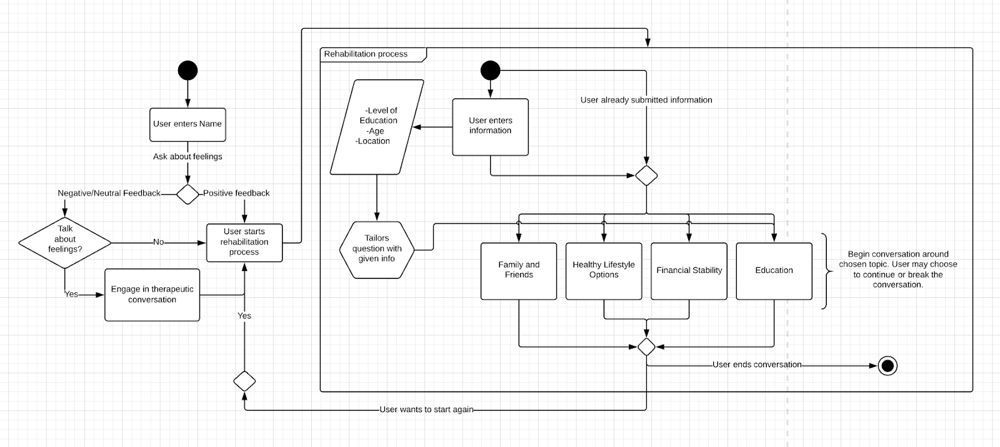
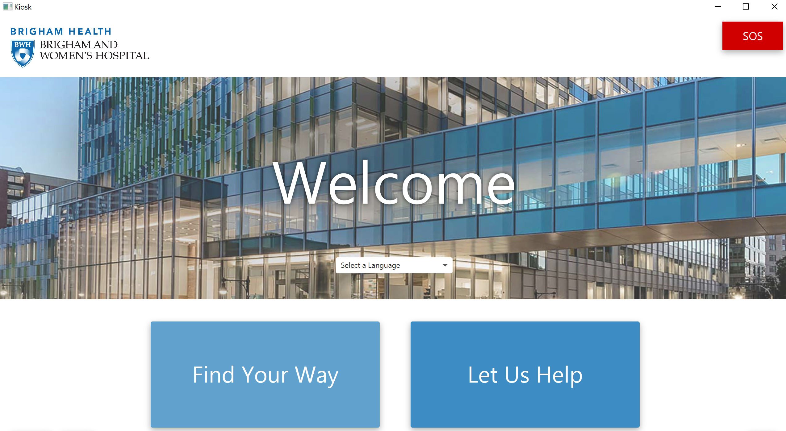
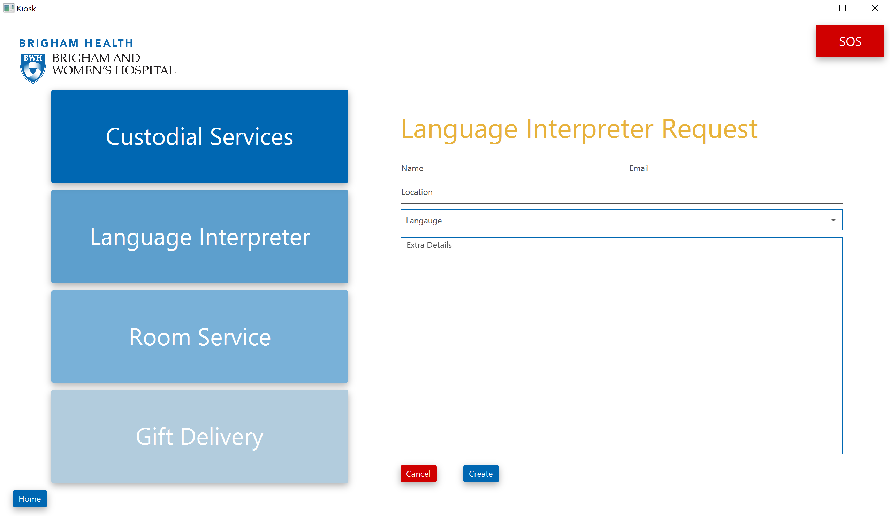
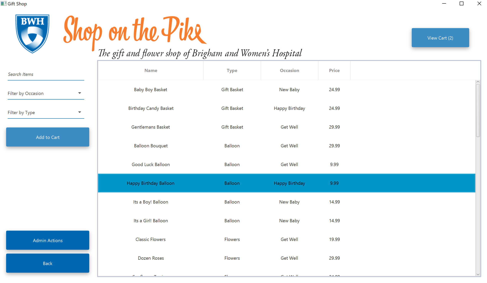

# Design Manifesto

As a student this term, I gained much more experience in HCI than I have in any other term through my expereince in this class as well as my experience in Software Engineering designing an application that allows for pathfinding through Brigham & Women's Hospital.
The design process I developed in both classes ended up having an impact on the other, and I believe they are the perfect pairing to develop a student's HCI abiilties. The knowledge gained from HCI and the assigned articles gave me inspiration for the Hospital Pathfinding project, while the intense user testing and development life cycle of Software Engineering allowed me to go more in depth into the assignments in HCI.
_(PS: I talk about Software Engineering a lot in this post! Can you tell that it took over my term?)_

Below are 5 key points that came to define my design process this term.
Return to the portfolio here.

## Don’t rush.
Starting at the beginning of the term, I ignored the design process that was recomended. I simply just rushed ahead and did the projects without any brainstorming, user testing, or prepararion. And although I didn't know it, it showed.
I actually didn't come to realise it in HCI, but in Software Engineering when during our presentation I realised how cluttered and difficult to use our UI was. What it took was some distance to understand that taking your time and actually following a fleshed out design will force you to take your time and truly think about what you're doing before you implement it.
A key example in HCI was in the Design for Others project in which we decided that the given website was already good enough so we just resized it into a mobile format instead of brainstorming a new UI that would actually be better and designed from the ground up for mobile. The lesson that I learned there I will carry over for the rest of my career as a Computer Scientist and already have, as seviddneced by my new stragtegy with the later HCI projects.  

  
_As you can see here, by Design for Tension I had begun fleshing out Brainstorms in a way that I never had before._

## Empathize.
I've always been someone who immediatly empathizes with people whenever they talk about their struggles, I easily put myself in their shoes and geniunly try to understand them.
I cam to understand this term that empathy just as important a trait in HCI as in society. In my later projects, I began working on topics that appealed to my sense of empathy (in Design for Tension we created a chatbot for prisoners who will have a tough time once realeased into society and in Design for Another World we created a simulation meant to calm and relax patients) In these projects, it became really important to put myself in the shoes of the users, to try and really understand how they were feeling and what they needed from the aaplicaton.

## Simpler is better.
Most of my HCI projects were relatively simple, but it's their simplicity that taught me its merits. For instance, in Software Engineering, our UI started off rather clunky and complicated, but by the end we had the winning application which featured a simplistic design that did not compromise any functionality or usability. Our design in Design for Others featured an overly complex UI for a mobile device, one that had lots of buttons and links as you scrolled through the webapge (can you tell that that's the project I leanred the most from my mistakes on?) and was just overall not enjoyable to use or look at. I applied what I learned from these mistakes to my later projects, and the results are most visible in my Software Engineering application, where we made things simple, large, and easy to understand.  

    
_A few of the UIs I designed for the Welcome Screen, Request Screen, and Gift Shop Screen for the Software Engineering project that emphasized Google's Material Design Concepts and Simplicity._

## Research on people, not Google.
Prior to this course, it was always easy for me to just google design ideas and stragegies as opposed to designing _for_ a user. But I've since learned that every project you work on is far too specific to just have a cookie-cutter answer from onine, and you truly need  a real person to survey and test with. And either way, if your design is simple enough to have an wasy answer online, it's too generic to be worth doing.
An example of this from this term was my habit of getting inspiration from online in both HCI and Software Engineering. This resulted in bland, boring, unoriginal designs that hindered the final product.

## Create a chain-of-events.
A technique that I found incredibly useful in both creating and eveluating my designs was the create a chain-of-events of sorts. First of all, this allowed me to develop a concrete idea of _exactly_ how I wanted the application to work and be used, providing a plan from which to design from. During the user testing stage, this chain-of-events came in useful again because comparing what I thought and intended the user would do to what they actually did was always iluminating, it showed how people were _actually_ intrepreting my design, allowing me to see exactly where my plans either went wrong or needed to be rethought.

